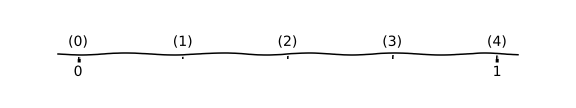
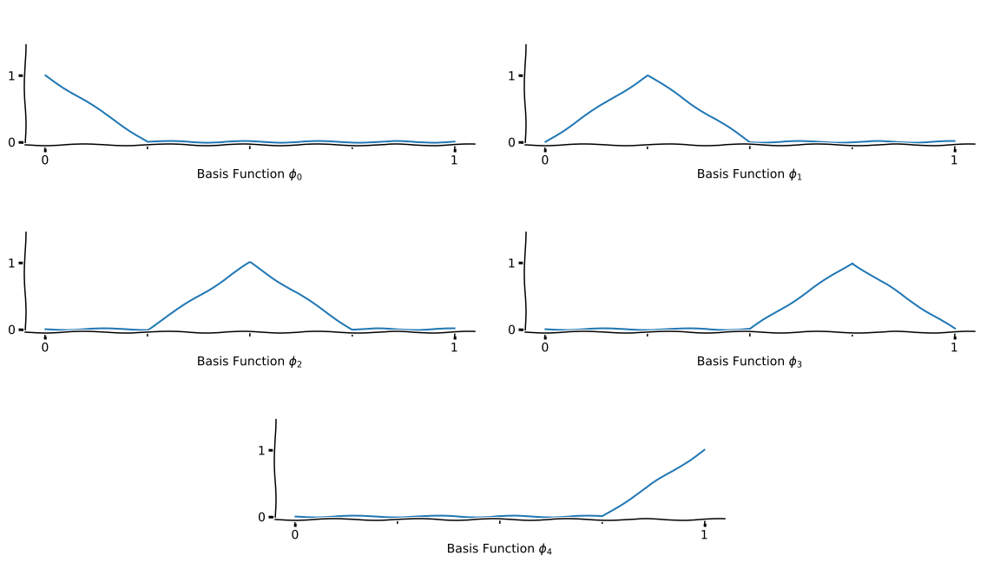
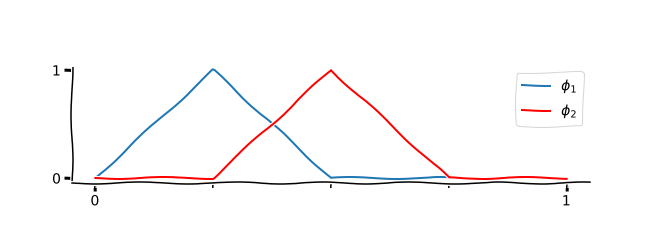
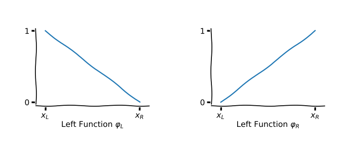
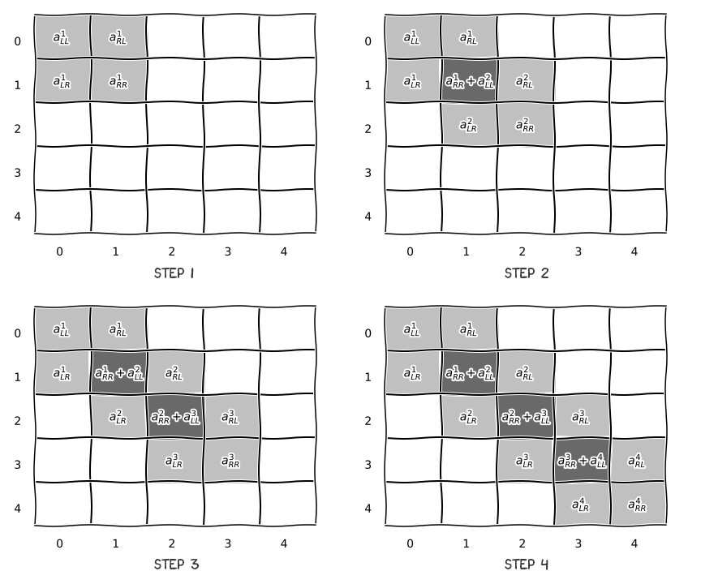
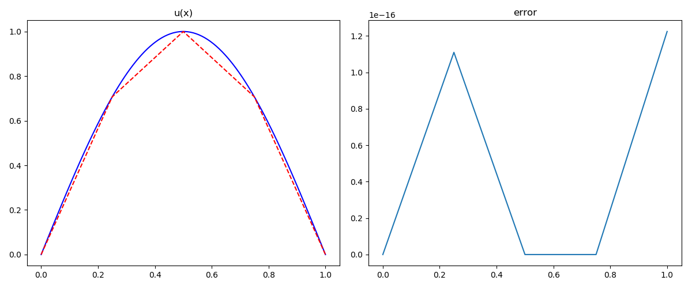
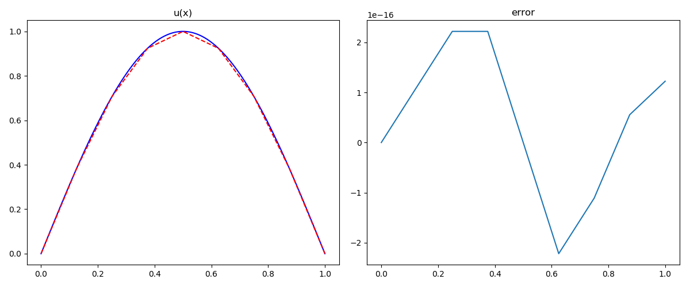

有限元方法多用于二维、三维的区域上，相比于有限差分方法，对非规则网格的适应性较好。而在一维区域上，有限元方法与有限差分方法相比，没有太大的优势。但从一维的例子讲起，有助于由浅及深的了解有限元的思想。

有限元方法多用于椭圆方程的求解，考虑最为常见的椭圆型方程——Poisson方程，如下：

$$
\begin{cases}
-\nabla^2 u=f(x),\quad &x\in \Omega \\
u|_{\Gamma}=\alpha(x),\quad &x\in \Gamma
\end{cases}
$$

其中 $\Omega$ 是 $x$ 区域上的一个有界区间，边界 $\Gamma$ 是区间 $\Gamma$ 的两侧端点。

我们选取具体的一维Poisson方程，来讲一讲有限元方法的具体步骤：

$$
\begin{cases}
-\nabla^2 u=\pi^2 \mathrm{sin}(\pi x),\quad &x\in (0, 1) \\
u(0)=0, u(1)=0
\end{cases}
$$

## 1. 构造变分形式

对于任意的 $v \in H^1_0$，乘以 $-\nabla^2 u=f$ 的两侧，运用Green公式，并带入边界条件可以得到：

$$
-\int \nabla u\cdot \nabla v \mathrm{d}x= \int f\cdot v \mathrm{d}x
$$

即得到边值的变分形式 $a(u, v)=(f,v)$。

## 2. 剖分区域

接下来剖分区域 $(0, 1)$，为方便起见，选择均匀剖分的方式，构造**一致网格**



将 $(0, 1)$ 区间均匀剖分为 4 部分，网格点坐标分别为 $x_0=0.00$，$x_1=0.25$，$x_2=0.50$，$x_3=0.75$，$x_4=1.00$。

再构造节点坐标矩阵 $P$，单元节点矩阵 $E$，边界布尔矩阵 $B$

$$
P =
\left[
\begin{matrix}
0.00 \\ 0.25 \\ 0.50 \\ 0.75 \\ 1.00
\end{matrix}
\right],\quad
E =
\left[
\begin{matrix}
0 & 1 \\ 1 & 2 \\ 2 & 3 \\ 3 & 4
\end{matrix}
\right],\quad
B =
\left[
\begin{matrix}
1 \\ 0 \\ 0 \\ 0 \\ 1
\end{matrix}
\right]
$$

```python
import numpy as np
# 均匀剖分(0,1)区间为n份
n = 4
# 节点坐标矩阵P
P = np.linespace(0, 1, n+1)
# 单元节点矩阵E
E = np.transpose([np.arange(0, n), np.arange(1, n+1)])
# 边界布尔矩阵B
B = np.zeros(n, dtype=np.bool); B[0, -1] = True
```

## 3. 建立有限元空间

### 有限元空间

在第一步构造变分形式的时候，我们提到选取 $v\in H^1_0$，构造形如 $a(u, v)=(f, v)$ 的弱形式，而要进行有限元计算，则需要构造Sobolev空间 $H^1_0$ 的有限维子空间 $V_h$（其中 $h=\mathrm{h_i}$，这里构造的是一致网格，故 $h_i$ 为 $\frac{1}{4}$），其中 $u_h\in V_h$ 是次数不超过1的多项式，在区间 $(0, 1)$ 上属于函数空间 $H^1_0$，且有 $u_h(0)=u_h(1)=0$。

最简单的分段线性函数空间 $V_h$ 是由分段线性函数组成的，它由节点上的一组值

$$u_0=0, u_1, u_2, \cdots, u_{n-2}, u_{n-1}, u_n=0$$

按照线性插值公式

$$u_h(x)=\frac{x_i-x}{h_i}u_{i-1}+\frac{x-x_{i-1}}{h_i}u_i$$

确定，称为**线性有限元**（一次有限元）空间。

试探函数由 $n+1$ 个节点的值决定，故 $u_h$ 的自由度为 $n+1$，也即 $V_h$ 是 $n+1$ 维线性空间。

**PS**: *这里在构造试探函数空间 $V_h$ 的时候，仅说明了 $V_h\subset H^1_0$，而未带入边界条件*

### 基底函数

为推到有限元方程，需要构造有限元子空间 $V_h$ 的一组基底 $\phi_0, \phi_1, \cdots, \phi_{n-1}, \phi_n$。一般的，选择对每个节点构造**山形函数** $\phi_i$：

$$
\begin{align}
&\phi_0=
\begin{cases}
1 - \frac{x-x_0}{h_1},\quad &0 \leqslant x \leqslant x_1 \\\\
0,\quad &\text{else}
\end{cases} \\\\
&\phi_i=
\begin{cases}
1 + \frac{x-x_i}{h_i},\quad &x_{i-1} \leqslant x \leqslant x_i \\\\
1 - \frac{x-x_i}{h_{i+1}},\quad &x_i \leqslant x \leqslant x_{i+1} \\\\
0,\quad &\text{else}
\end{cases} \\\\
&\phi_n=
\begin{cases}
1 + \frac{x-x_n}{h_n},\quad &x_{n-1} \leqslant x \leqslant 1 \\\\
0,\quad &\text{else}
\end{cases}
\end{align}
$$



显然 $\phi_0,\ \phi_1,\ \cdots,\ \phi_{n-1},\ \phi_n$ 线性无关，且组成 $V_h$ 的基底，使得 $V_h=\mathrm{span}\{\phi_i\}^n_{i=0}$，且对于任意的 $u_h\in V_h$，都有 $u_h=\sum^n_{i=1}u_i \phi_i(x),\ u_i=u_h(x_i)$。

### 离散化变分问题

将试探函数 $u_h=\sum^n_{i=0}u_i \phi_i$ 和检验函数 $v_h\in \{\phi_i\}_{i=0}^n$，带入到变分形式中，得到

$$
\int \nabla u_h \cdot \nabla v_h \mathrm{d}x= \int f \cdot v_h \mathrm{d}x \\
\int \nabla \left(\sum^n_{j=0}u_j \phi_i\right) \cdot \nabla \phi_i \mathrm{d}x = \int f \cdot \phi_i \mathrm{d}x \\
\sum^n_{j=0}\left(\int \nabla \phi_j \cdot \nabla \phi_i \mathrm{d}x \right) u_j = \int f \cdot \phi_i \mathrm{d}x \\
$$

积分以内积形式表示，则方程表现为：
$$
\sum^n_{j=0}\left(\nabla\phi_j, \nabla\phi_i\right)u_j = \left(f, \phi_i\right),\quad i=0,\cdots,n
$$

```python
from scipy.integrate import quad
# 定义函数空间V上内积
def inner_product_1d(f0, f1, a, b):
    return quad(lambda x: f0(x) * f1(x), a, b)[0]
```

### 单元左右函数

对于区间 $(x_i, x_{i+1})$，存在不为零的基函数 $\phi_i$ 和 $\phi_{i+1}$，且有

$$
\phi_i = 1 - \frac{x-x_i}{h_{i+1}}, \phi_{i+1} = 1 + \frac{x-x_{i+1}}{h_{i+1}},\quad x_{i} \leqslant x \leqslant x_{i+1}
$$



为方便计算起见，定义每个单元上的左函数、右函数

$$
\varphi_L = \frac{x-x_R}{x_L-x_R},\quad \varphi_L = \frac{x-x_L}{x_R-x_L}
$$



则区间上左右函数与基函数的对应关系如下：

$$
\begin{cases}
\varphi^i_L(x) = \phi_{i-1}(x) \\
\varphi^i_R(x) = \phi_{i}(x) \\
\end{cases},\quad x\in (x_{i-1}, x_i),\quad i=1,\cdots, n
$$

```python
# 定义左函数
def phi_l(l, r):
    return lambda x: (x - r) / (l - r)
# 定义右函数
def phi_r(l, r):
    return lambda x: (x - l) / (r - l)
# 定义左函数的一阶导数
def phi_l_d1(l, r):
    return lambda x: 1 / (l - r)
# 定义右函数的一阶导数
def phi_r_d1(l, r):
    return lambda x: 1 / (r - l)
```

## 4. 建立有限元方程组

由离散变分形式 $\sum^n_{j=1}\left(\nabla\phi_j(x), \nabla\phi_i\right)u_j \mathrm{d}x = \left(f, \phi_i\right) \\$， 其中 $\left(f, \phi_i\right)$ 和 $\left(\nabla\phi_j(x), \nabla\phi_i\right)$ 都为常数，故可以得到：

$$
\begin{cases}
\sum^n_{j=1}\left(\nabla\phi_j(x), \nabla\phi_0\right)u_j \mathrm{d}x = \left(f, \phi_0\right) \\\\
\cdots \\\\
\sum^n_{j=1}\left(\nabla\phi_j(x), \nabla\phi_i\right)u_j \mathrm{d}x = \left(f, \phi_i\right) \\\\
\cdots \\\\
\sum^n_{j=1}\left(\nabla\phi_j(x), \nabla\phi_n\right)u_j \mathrm{d}x = \left(f, \phi_n\right) \\\\
\end{cases}
$$

即将有限元问题转化为求解线性方程组：

$$KU=F$$

### 组装载荷列阵F

$F$ 称为**总载荷列阵**

$$
F =
\left[
\begin{matrix}
(f, \phi_0)\\\\
\cdots \\\\
(f, \phi_i)\\\\
\cdots \\\\
(f, \phi_n)\\\\
\end{matrix}
\right]=
\left[
\begin{matrix}
(f, \varphi^1_R)\\\\
(f, \varphi^1_L) + (f, \varphi^2_R) \\\\
\cdots \\\\
(f, \varphi^i_L) + (f, \varphi^{i+1}_R) \\\\
\cdots \\\\
(f, \varphi^{n-1}_L) + (f, \varphi^n_R) \\\\
(f, \varphi^n_L)\\\\
\end{matrix}
\right]
$$

基于每一单元，计算载荷列阵，记为 $F_i$，称为**单元载荷列阵**

$$
F_i =
\left[
\begin{matrix}
(f, \varphi^i_L) \\\\
(f, \varphi^i_R)
\end{matrix}
\right], \quad i=1, \cdots,n
$$

```python
# 计算单元载荷列阵, 并组装总载荷列阵
for k, v in enumerate(E):
    l_inx, r_inx = v
    l_cor, r_cor = P[[l_inx, r_inx]]
    f_lst[l_inx] += inner_product(f, phi_l(l_cor, r_cor), l_cor, r_cor)
    f_lst[r_inx] += inner_product(f, phi_r(l_cor, r_cor), l_cor, r_cor)
```

### 组装刚度矩阵K

$K$ 称为**总刚度矩阵**

$$
\begin{align}K &=
\left[
\begin{matrix}
(\phi_0, \phi_0) & \cdots & (\phi_i, \phi_0) & \cdots & (\phi_n, \phi_0) \\\\
\vdots           & \ddots & \vdots           & \ddots & \vdots           \\\\
(\phi_0, \phi_i) & \cdots & (\phi_i, \phi_i) & \cdots & (\phi_n, \phi_i) \\\\
\vdots           & \ddots & \vdots           & \ddots & \vdots           \\\\
(\phi_0, \phi_n) & \cdots & (\phi_i, \phi_n) & \cdots & (\phi_n, \phi_n) \\\\
\end{matrix}
\right]\\\\
&=\left[
\begin{matrix}
a^1_{LL} & a^1_{RL} &  &  &  &  & \\\\
a^1_{LR} & a^1_{RR}+a^2_{LL} & a^2_{RL} &  &  &  & \\\\
  & a^2_{LR} & a^2_{RR}+a^3_{LL} & a^3_{RL} &  & \\\\
  &  & \ddots & \ddots & \ddots & \\\\
  &  &  & a^{n-1}_{LR} & a^{n-1}_{RR}+a^n_{LL} & a^n_{RL} \\\\
  &  &  &   & a^n_{LR} & a^n_{RR} \\\\
\end{matrix}
\right]
\end{align}
$$

基于每一单元，计算刚度矩阵，记为 $K_i$，称为**单元刚度矩阵**

$$
K_i =
\left[
\begin{matrix}
(\varphi^i_L, \varphi^i_L) & (\varphi^i_L, \varphi^i_R) \\\\
(\varphi^i_R, \varphi^i_L) & (\varphi^i_R, \varphi^i_R)
\end{matrix}
\right],\quad i=1, \cdots,n
$$

由单元刚度矩阵组装总刚度矩阵的过程如下：



可知总刚度矩阵为**三对角矩阵**。

```python
# 计算单元刚度矩阵, 并组装总刚度矩阵
for k, v in enumerate(E):
    l_inx, r_inx = v
    l_cor, r_cor = P[[l_inx, r_inx]]
    a_mat[l_inx,l_inx]+=inner_product(phi_l_d1(l_cor,r_cor), phi_l_d1(l_cor,r_cor), l_cor, r_cor)
    a_mat[l_inx,r_inx]+=inner_product(phi_r_d1(l_cor,r_cor), phi_l_d1(l_cor,r_cor), l_cor, r_cor)
    a_mat[r_inx,l_inx]+=inner_product(phi_l_d1(l_cor,r_cor), phi_r_d1(l_cor,r_cor), l_cor, r_cor)
    a_mat[r_inx,r_inx]+=inner_product(phi_r_d1(l_cor,r_cor), phi_r_d1(l_cor,r_cor), l_cor, r_cor)
```

### 位移列阵U

$U$ 称为**总位移列阵**

$U$ 中的每一个元素 $u_i$ 即为函数 $u_h$ 在 $x_i$ 点处的取值

$$U=\left[\begin{matrix}u_0 & u_1 & \cdots & u_{n-1} & u_n \end{matrix}\right]^T$$

### 边界条件处理

#### Dirichlet边界条件

由**Dirichlet边界条件**可知 $u_0=u_n=0$，应用在总刚度矩阵中，则有

$$
K_0 U = F_0
$$

$$
\left[
\begin{matrix}
1 & 0 & 0 & \cdots & 0 & 0 & 0 \\\\
a_{1, 0} & a_{11} & a_{12} & \cdots & 0 & 0 & 0\\\\
0 & a_{11} & a_{12} & \cdots & 0 & 0 & 0 \\\\
\vdots & \vdots & \vdots & \ddots & \vdots & \vdots & \vdots \\\\
0 & 0 & 0 & \cdots & a_{n-2, n-2} & a_{n-2, n-1} & 0 \\\\
0 & 0 & 0 & \cdots & a_{n-1, n-2} & a_{n-1, n-1} & a_{n-1, n} \\\\
0 & 0 & 0 & \cdots & 0 & 0 & 1 \\\\
\end{matrix}
\right]
\left[
\begin{matrix}
u_0 \\\\ u_1 \\\\ u_2 \\\\ \vdots \\\\ u_{n-2} \\\\ u_{n-1} \\\\ u_n \\\\
\end{matrix}
\right]=
\left[
\begin{matrix}
0 \\\\ f_1 \\\\ f_2 \\\\ \vdots \\\\ f_{n-2} \\\\ f_{n-1} \\\\ 0 \\\\
\end{matrix}
\right]
$$

为保持三对角矩阵形式，做如下变换：

$$
K_0 U = F_0
$$

$$
\left[
\begin{matrix}
1 & 0 & 0 & \cdots & 0 & 0 & 0 \\\\
0 & a_{11} & a_{12} & \cdots & 0 & 0 & 0\\\\
0 & a_{11} & a_{12} & \cdots & 0 & 0 & 0 \\\\
\vdots & \vdots & \vdots & \ddots & \vdots & \vdots & \vdots \\\\
0 & 0 & 0 & \cdots & a_{n-2, n-2} & a_{n-2, n-1} & 0 \\\\
0 & 0 & 0 & \cdots & a_{n-1, n-2} & a_{n-1, n-1} & 0 \\\\
0 & 0 & 0 & \cdots & 0 & 0 & 1 \\\\
\end{matrix}
\right]
\left[
\begin{matrix}
u_0 \\\\ u_1 \\\\ u_2 \\\\ \vdots \\\\ u_{n-2} \\\\ u_{n-1} \\\\ u_n \\\\
\end{matrix}
\right]=
\left[
\begin{matrix}
0 \\\\ f_1 - a_{1, 0}u_0 \\\\ f_2 \\\\ \vdots \\\\ f_{n-2} \\\\ f_{n-1}-a_{n-1, n}u_n \\\\ 0 \\\\
\end{matrix}
\right]
$$

```python
# 应用边界条件
self.f_lst[B] = 0
# 保持三对角形式
self.a_mat[B, :] = 0
self.a_mat[:, B] = 0
self.a_mat[B, B] = 1
```

## 5. 求解有限元方程组

求解线性方程组 $K_0 U=F_0$，具体方法此处不再详述。

```python
from scipy.linalg import solve
u_lst = solve(a_mat, f_lst)
```

## 6. 误差检验

若已知方程真解 $u(x)$，且计算得到数值解 $u_h(x)$，则可计算误差
$$
e(x)=u(x)-u_h(x)
$$
定义 $L^2$ 空间上的误差范数
$$
E_N^2=||e(x)||^2=\sum^N_{i=1}\int_{I_i}|u(x)-u_h(x)|^2\mathrm{d}x
$$
若计算得
$$
\frac{E_N}{E_{2N}}\approx4
$$
则说明数值计算结果是有效的。

## 7. 计算结果

### 计算数值解

易知选取的边值问题真解为 $u(x)=\sin(\pi x)$

取 $N=4$，计算结果如下

| $x_{i}$ | 0.0  | 0.25       | 0.5  | 0.75       | 1.0  |
| ------- | ---- | ---------- | ---- | ---------- | ---- |
| $u_{i}$ | 0.0  | 0.70710678 | 1.0  | 0.70710678 | 0.0  |

$$
E_4=0.03928434776482386
$$



取 $N=8$，计算结果如下

| $x_{i}$ | 0.0  | 0.125      | 0.25       | 0.375      |
| ------- | ---- | ---------- | ---------- | ---------- |
| $u_i$   | 0.0  | 0.38268343 | 0.70710678 | 0.92387953 |

| 0.5  | 0.625      | 0.75       | 0.875      | 1.0  |
| ---- | ---------- | ---------- | ---------- | ---- |
| 1.0  | 0.92387953 | 0.70710678 | 0.38268343 | 0.0  |

$$
E_8=0.00992091991146414
$$



### 计算误差阶数

$$
\frac{E_4}{E_8}=\frac{0.03928434776482386}{0.00992091991146414}=3.9597485026997092\approx 4
$$

可见 $P=\frac{E_N}{E_{2N}}$ 趋近于 4，所以该数值方法是有效的

**PS**: 文中只简单的展示了部分核心代码，具体的实现请转到 [Github: fempy](https://github.com/EastMagica/fempy)，代码实现较为仓促，如有问题，欢迎批评指正~
